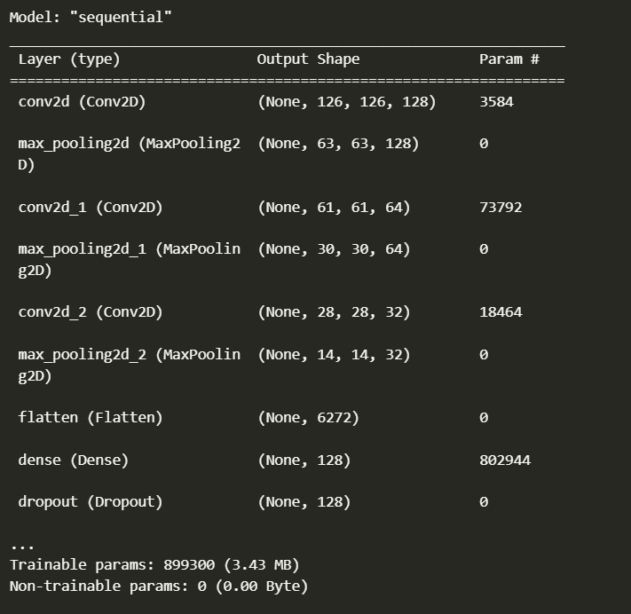
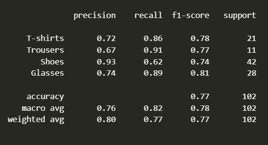

# 👕 Product Picture Classification

Welcome to our Clothing Store Classifier app! This application leverages a pre-trained CNN model to Classify clothing items in uploaded images and classify them into categories. Let's get started! 📸

## 🛠️ Installation

1. **Clone the Repository**:
   ```bash
   git clone https://github.com/salmamuhammede/Product-Picture-Classification-CNN-model.git
   cd repository

2. **Install Dependencies**:
Ensure you have Python 3.8+ installed. Then, create a virtual environment and install the required packages:

3. **Trainig Dataset**: 
All the dataset are from RoboFlow Universe:
let's see a sample of training dataset 
📸 Training Sample


4. **CNN model summary**: 
Here is a total suammary of cnn model archuiture 
📄 Model Summary


# 📂 Test Cases
Here are some sample images you can use to test the object detection capabilities of the app. Download and upload these images to see the model in action:

1. 🕶️ Confussion matrix

2. 🤖 Accuracy Report

3. 😎 Test Sample

# Hope you enjoy my project 😄


